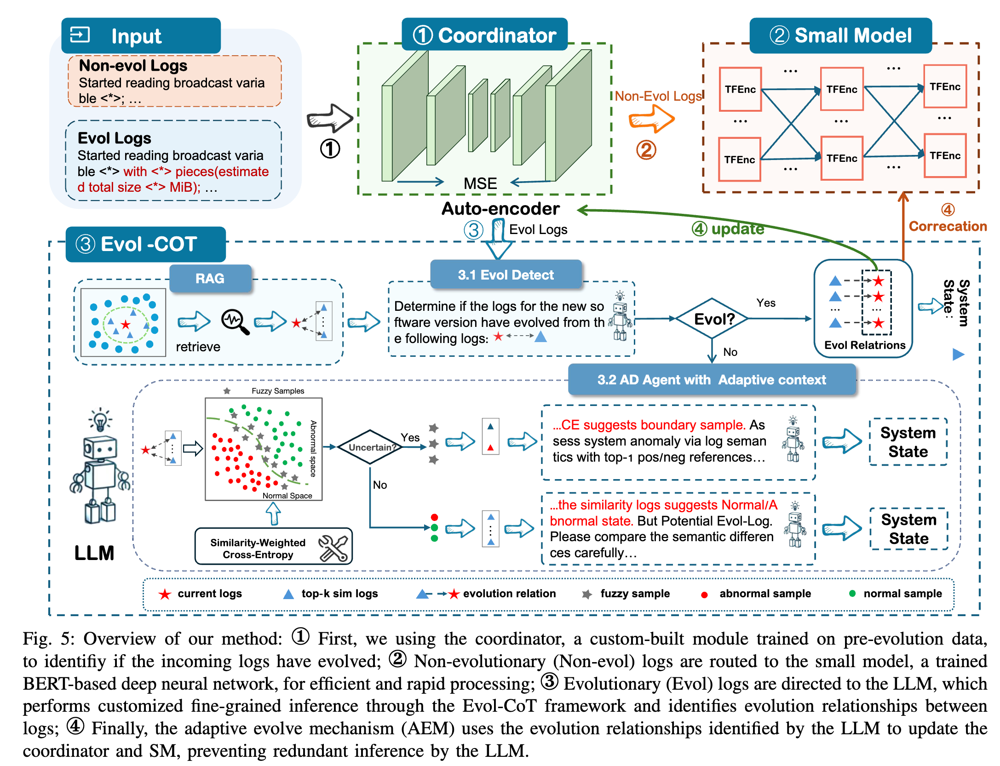
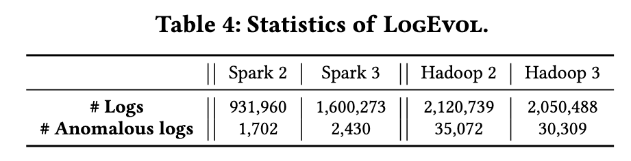
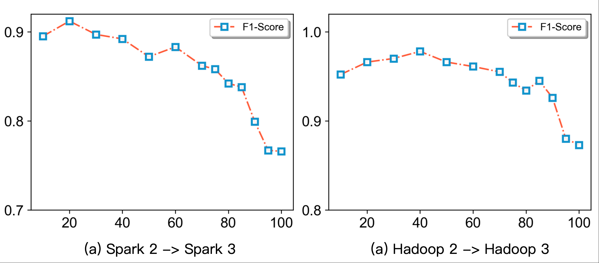
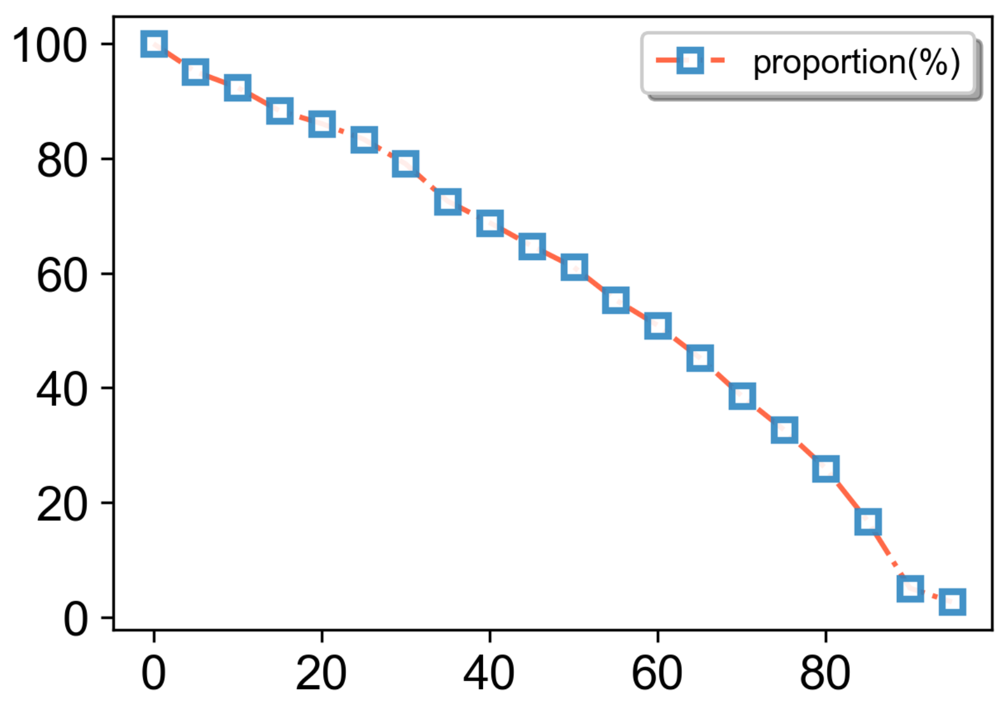
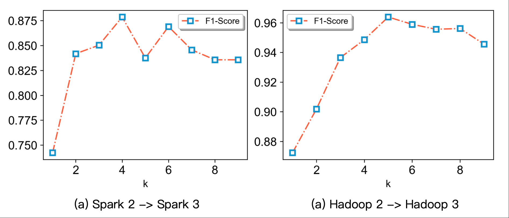
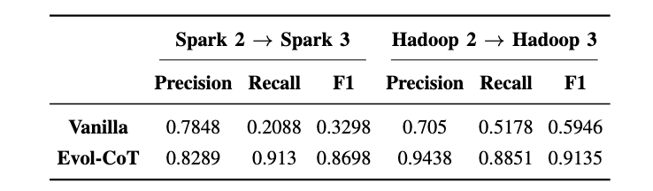

# CollaborLog: Efficient-Generalizable Log Anomaly Detection via Large-Small Model Collaboration in Software Evolution

- [CollaborLog](#collaborlog)
- [Project Structure](#project-structure)
- [Datasets](#dataset)
- [Supplemental Result](#supplemental-result)
  - [Results of LogHub](#results-of-loghub)
  - [Parameter Sensitivity Analysis](#parameter-sensitivity-analysis)
    - [$\tau$](#τ)
    - [k](#k)
  - [Study of Evol-CoT](#study-of-evol-cot)
  - [Case Study](#case-study)
- [Implement Detail](#implement-detail)
  - [Coordinator](#coordinator)
  - [Small Model](#small-model)
  - [LLM](#llm)
- [Environment](#️-environment)
- [Run](#run)
# CollaborLog
Frequent software updates lead to log evolution, posing generalization challenges for current log anomaly detection. Traditional log anomaly detection research focuses on using small deep learning models (SMs), but these models inherently lack generalization due to their closed-world assumption. Large Language Models (LLMs) exhibit strong semantic understanding and generalization capabilities, making them promising for log anomaly detection. However, they suffer from computational inefficiencies.
To balance efficiency and generalization, we propose a collaborative log anomaly detection scheme using an adaptive coordinator to integrate SM and LLM. The coordinator determines if incoming logs have evolved. Non-evolutionary los are routed to the SM, while evolutionary logs are directed to the LLM for detailed inference using the constructed Evol-CoT. To gradually adapt to evolution, we introduce the adaptive evolve mechanism (AEM), which updates the coordinator to redirect evolutionary logs identified by the LLM to the SM. Simultaneously, the SM is fine-tuned to inherit the LLM's judgment on these logs.


# project-structure
```
├─config/           # Configuration files storing various parameters
├─prompt/           # Prompts for large language models
├─modules/            
│  ├─AutoEncoder.py   # Coordinator
│  └─llm_chats.py    # Encapsulated LLM interaction interface  
├─CollaborLog.py         # entries
```

# Dataset

We conduct extensive experiments on LOGEVOL(\url{https://github.com/YintongHuo/EvLog}), a publicly available dataset that records software evolution activities. LOGEVOL is generated using the HiBench benchmarking suite~\cite{hibench}, which runs a diverse set of workflows ranging from basic to complex scenarios in Spark and Hadoop. A total of 22 workloads are executed across the system, covering a wider range of real-world scenarios compared to other public datasets. 



We also practiced our approach on two open datasets, BGL and Zookeeper from LogHub(https://github.com/logpai/loghub).

# Supplemental Result

## Results of Loghub
We also practiced our approach on two open datasets, BGL and Zookeeper, from LogHub. Similar to recent work on evolutionary logs, we set the earlier logs as the training set and the
logs from 14 days later as the test set to ensure that the log patterns change over time. We also follow the standard 8:1:1 split, randomly dividing the logs for each software version into
training, validation, and test sets.

 On LogHub, our method achieved higher F1-scores than using either the small model or LLM alone.


## Parameter Sensitivity Analysis

### τ
τ controls how many samples go to the LLM. Too small → high cost; too large → poor routing and degraded performance. We select a τ with low F1 and acceptable volume to balance both.
The following figure small model’s F1-score on evolved logs under different τ values. Low F1 indicates expected drift. When τ < 40, evolved vs. non-evolved logs are hard to distinguish, causing unstable F1 scores.



Under the Spark dataset, the changes in the percentile of the corresponding loss value with respect to the proportion of selected samples are as follows. It can be observed that at Q90, both the F1-Score and the downward trend of the proportion have an inflection point. Therefore, we choose $\tau$ as the turning point on the Spark dataset.


### k 
We select the best k based on the small model’s F1-score on the validation set. Different k values cause only minor changes in the F1-score. The sensitivity analysis is shown in [1].




## Study of Evol-CoT


|                |              | Spark 2 -> Spark 3 | Spark 2 -> Spark 3 | Hadoop 2 -> Hadoop 3 | Hadoop 2 -> Hadoop 3 |
| -------------- | ------------ | ------------------ | ------------------ | -------------------- | -------------------- |
|                |              | Proportion         | F1                 | Proportion           | F1                   |
|  |       **Evol Detect**        | 8.5%               | 99.7%              | 4.82%                | 98.6%                |
| **AD Agent**    | **Uncertain** | 1.43%              | 78.3%              | 0.97%                | 71.2%                |
|                | **Certain**   | 7.66%              | 87.6%              | 3.69%                | 90.6%                |

## Case Study
By guiding large models to think step by step, it not only helps reduce hallucinations but also allows the demonstration of the large model's reasoning process, providing more interpretability for log anomaly detection.

### Evol Detect

Given the current log sequence and similar historical log sequences, large models can determine whether there is an evolutionary relationship between the two through semantic analysis.

For example:

Given logs:
```text
 - Driver commanded a shutdown;
 - MemoryStore cleared;
 - BlockManager stopped;
 - Shutdown hook called;
 - Deleting directory /usr/local/tmp/nm-local-dir/usercache/root/appcache/application_1630409651274_0110/spark-ab99e583-a469-4d2b-8e0d-e6f725459c1d;
 - Driver requested a total number of 0 executor(s).;
 - Driver terminated or disconnected! Shutting down. sp3:35521;
 - Driver terminated or disconnected! Shutting down. sp3:35521;
 - Final app status: SUCCEEDED, exitCode: 0;
 - Unregistering ApplicationMaster with SUCCEEDED;
 - Waiting for application to be successfully unregistered.;
 - Deleting staging directory hdfs://172.17.0.2:9000/user/root/.sparkStaging/application_1630409651274_0110;
 - Driver commanded a shutdown;
 - MemoryStore cleared;
 - BlockManager stopped;
 - Shutdown hook called;
 - Deleting directory /usr/local/tmp/nm-local-dir/usercache/root/appcache/application_1630409651274_0110/spark-fba93b39-e1c0-48b0-8988-af6dcfa2f569;
```


The  similar log retrieved is
```text
 - Driver commanded a shutdown;
 - MemoryStore cleared;
 - BlockManager stopped;
 - Shutdown hook called;
 - Deleting directory /usr/local/tmp/nm-local-dir/usercache/root/appcache/application_1629275090372_0014/spark-b39df885-178f-43b9-a780-26d94a1e51ca;
 - Driver requested a total number of 0 executor(s).;
 - Driver terminated or disconnected! Shutting down. master:34041;
 - Driver terminated or disconnected! Shutting down. master:34041;
 - Final app status: SUCCEEDED, exitCode: 0;
 - Unregistering ApplicationMaster with SUCCEEDED;
 - Waiting for application to be successfully unregistered.;
 - Deleting staging directory hdfs://172.17.0.5:9000/user/root/.sparkStaging/application_1629275090372_0014;
 - Shutdown hook called;
 - Saved output of task 'attempt_20210818101826_0006_m_000004_0' to hdfs://172.17.0.5:9000/user/root/HiBench/Wordcount/Output/_temporary/0/task_20210818101826_0006_m_000004;
 - attempt_20210818101826_0006_m_000004_0: Committed;
 - Finished task 4.0 in stage 1.0 (TID 28). 1459 bytes result sent to driver;
 - Saved output of task 'attempt_20210818101826_0006_m_000000_0' to hdfs://172.17.0.5:9000/user/root/HiBench/Wordcount/Output/_temporary/0/task_20210818101826_0006_m_000000;
 - attempt_20210818101826_0006_m_000000_0: Committed;
 - Finished task 0.0 in stage 1.0 (TID 24). 1459 bytes result sent to driver;
 - Driver commanded a shutdown;
 - MemoryStore cleared;
 - BlockManager stopped;
 - Shutdown hook called;
 - Deleting directory /usr/local/tmp/nm-local-dir/usercache/root/appcache/application_1629275090372_0014/spark-33c13cb9-ba68-41cc-b153-5448e12a55f0;
```

Let the LLM determine whether there is an evolutionary relationship between the two, and output the reasoning process to enhance reliability.
```json
{
  "IsEvol": "True",
  "reason": "The log sequence in 'evolution_after' shows a normal system shutdown state, consistent with the semantics of 'evolution_before'. Both sequences represent the standard Spark application termination process, including driver shutdown, resource cleanup, and unregistration with final status SUCCEEDED. The differences are minor and expected due to software evolution: (1) application IDs and Spark directory UUIDs have changed (e.g., application_1629788447699_0105 → application_1630409651274_0110, different UUIDs), which is typical across runs; (2) the master address changed from 'master:45189' to 'sp3:35521', reflecting a different execution environment or cluster configuration, but the log message structure and meaning remain unchanged. There are no significant changes in log order, dependencies, or semantics. The repetition of shutdown-related logs (likely from multiple components or phases) is preserved identically. These are characteristic of log entry evolution (e.g., updated identifiers and hostnames) without altering the underlying system behavior or log meaning. Therefore, an evolutionary relationship exists."
}
```
### AD Agent

For the above example, first, since the categories of the similar logs are highly consistent, this log is determined to be a sample with high certainty. By taking the top-k similar logs as reference examples, the large model is enabled to demonstrate the reasoning process through the methods of Chain-of-Thought (CoT) and few-shot learning, and finally obtain the judgment on the system state.

```text
{
    "System State": "Normal",
    "reason": "The Given_Logs are semantically consistent with the most aligned log sequence in Similar_Logs. Both follow a pattern of a controlled shutdown process: starting with 'Driver commanded a shutdown', followed by resource cleanup (MemoryStore cleared, BlockManager stopped, Shutdown hook called), directory deletion, driver terminating, final app status marked as 'SUCCEEDED' with exitCode 0, unregistering the ApplicationMaster successfully, and repeating shutdown steps for additional directories. Differences in specific directory paths and hostnames (e.g., 'sp3' vs 'master') are expected as they are application-specific and do not indicate anomalies. Since the Similar_Logs_labels are all 0 (assumed to represent normal state), the current system state is Normal."
}
```
# Implement Detail
## Coordinator
First, we use a pre-trained BERT to extract the embedding (768-dimensional) of each log entry. Then, we aggregate the embeddings of all log entries in a log sequence by summing and averaging to obtain the embedding of the entire sequence. This embedding is then input into a deep autoencoder, and finally, the reconstruction loss is output.

Autoencoder parameters:

| Parameter | Value         |
|-----------|---------------|
| AE hidden layer dimensions | [64, 128, 64] |
| batch_size | 256           |
| Learning rate | 0.001         |
| Training epochs | 50            |


## Small Model
The Small Model is a BERT-based semantic extraction network. It extracts feature vectors for each sequence, calculates the similarity between each pair of samples using these feature vectors, and then performs anomaly detection using the KNN approach based on this similarity.

Parameters of the BERT-based network:

| Parameter | Value |
|-----------|-------|
| Hidden layer dimensions | [128, 64, 32] |
| batch_size | 256 |
| Learning rate | 0.001 |
| Training epochs | 20 |


## LLM
We use qwen-PLUS as the base model, with temperature set to 0.01 and top-p to 0.95.

The three prompts in `./prompt/`:


# ⚙️ Environment
**Key Packages:**
```
Numpy
Pandas
scikit_learn
torch==1.13.1+cu116
tqdm
wandb
```

# Run
You need to follow these steps to **completely** run `CollaborLog`.
- **Step 1:** Download [Log Data](#datasets) and put it under `data` folder.
- **Step 2:** Configure QWEN_API_KEY in `./modules/llm_chat.py`
- **Step 3:** Run `python ./CollaborLog.py --config './config/spark3.yaml'` 


