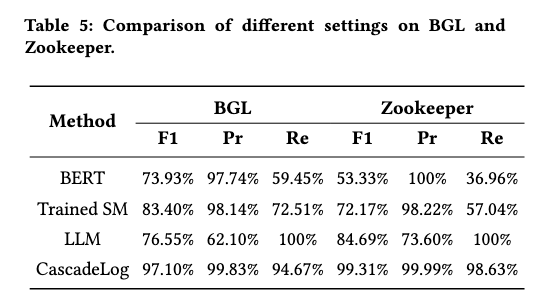

# CollaborLog: Efficient-Generalizable Log Anomaly Detection via Large-Small Model Collaboration in Software Evolution

- [CollaborLog](#collaborlog)
- [Project Structure](#project-structure)
- [Datasets](#dataset)
- [Supplemental Result](#supplemental-result)
  - [Results of LogHub](#results-of-loghub)
  - [Parameter Sensitivity Analysis](#parameter-sensitivity-analysis)
    - [$\tau$](#τ)
    - [k](#k)
  - [Study of Evol-CoT](#study-of-evol-cot)
  - [Case Study](#case-study)
- [Implement Detail](#implement-detail)
  - [Coordinator](#coordinator)
  - [Small Model](#small-model)
  - [LLM](#llm)
- [Environment](#️-environment)
- [Run](#run)
# CollaborLog
Frequent software updates lead to log evolution, posing generalization challenges for current log anomaly detection. Traditional log anomaly detection research focuses on using small deep learning models (SMs), but these models inherently lack generalization due to their closed-world assumption. Large Language Models (LLMs) exhibit strong semantic understanding and generalization capabilities, making them promising for log anomaly detection. However, they suffer from computational inefficiencies.
To balance efficiency and generalization, we propose a collaborative log anomaly detection scheme using an adaptive coordinator to integrate SM and LLM. The coordinator determines if incoming logs have evolved. Non-evolutionary los are routed to the SM, while evolutionary logs are directed to the LLM for detailed inference using the constructed Evol-CoT. To gradually adapt to evolution, we introduce the adaptive evolve mechanism (AEM), which updates the coordinator to redirect evolutionary logs identified by the LLM to the SM. Simultaneously, the SM is fine-tuned to inherit the LLM's judgment on these logs.


# project-structure
```
├─config/           # Configuration files storing various parameters
├─prompt/           # Prompts for large language models
├─modules/            
│  ├─AutoEncoder.py   # Coordinator
│  └─llm_chats.py    # Encapsulated LLM interaction interface  
├─CollaborLog.py         # entries
```

# Dataset

We conduct extensive experiments on LOGEVOL(\url{https://github.com/YintongHuo/EvLog}), a publicly available dataset that records software evolution activities. LOGEVOL is generated using the HiBench benchmarking suite~\cite{hibench}, which runs a diverse set of workflows ranging from basic to complex scenarios in Spark and Hadoop. A total of 22 workloads are executed across the system, covering a wider range of real-world scenarios compared to other public datasets. 


We also practiced our approach on two open datasets, BGL and Zookeeper from LogHub(https://github.com/logpai/loghub).

# Supplemental Result

## Results of Loghub
We also practiced our approach on two open datasets, BGL and Zookeeper, from LogHub. Similar to recent work on evolutionary logs, we set the earlier logs as the training set and the
logs from 14 days later as the test set to ensure that the log patterns change over time. We also follow the standard 8:1:1 split, randomly dividing the logs for each software version into
training, validation, and test sets.

 On LogHub, our method achieved higher F1-scores than using either the small model or LLM alone.

## Parameter Sensitivity Analysis

### τ

### k 


## Study of Evol-CoT


|                |              | Spark 2 -> Spark 3 | Spark 2 -> Spark 3 | Hadoop 2 -> Hadoop 3 | Hadoop 2 -> Hadoop 3 |
| -------------- | ------------ | ------------------ | ------------------ | -------------------- | -------------------- |
|                |              | Proportion         | F1                 | Proportion           | F1                   |
|  |       **Evol Detect**        | 8.5%               | 99.7%              | 4.82%                | 98.6%                |
| **AD Agent**    | **Uncertain** | 1.43%              | 78.3%              | 0.97%                | 71.2%                |
|                | **Certain**   | 7.66%              | 87.6%              | 3.69%                | 90.6%                |

## Case Study

# Implement Detail
## Coordinator
First, we use a pre-trained BERT to extract the embedding (768-dimensional) of each log entry. Then, we aggregate the embeddings of all log entries in a log sequence by summing and averaging to obtain the embedding of the entire sequence. This embedding is then input into a deep autoencoder, and finally, the reconstruction loss is output.

Autoencoder parameters:

| Parameter | Value         |
|-----------|---------------|
| AE hidden layer dimensions | [64, 128, 64] |
| batch_size | 256           |
| Learning rate | 0.001         |
| Training epochs | 50            |


## Small Model
The Small Model is a BERT-based semantic extraction network. It extracts feature vectors for each sequence, calculates the similarity between each pair of samples using these feature vectors, and then performs anomaly detection using the KNN approach based on this similarity.

Parameters of the BERT-based network:

| Parameter | Value |
|-----------|-------|
| Hidden layer dimensions | [128, 64, 32] |
| batch_size | 256 |
| Learning rate | 0.001 |
| Training epochs | 20 |


## LLM
We use qwen-PLUS as the base model, with temperature set to 0.01 and top-p to 0.95.

The three prompts in `./prompt/`:


# ⚙️ Environment
**Key Packages:**
```
Numpy
Pandas
scikit_learn
torch==1.13.1+cu116
tqdm
wandb
```

# Run
You need to follow these steps to **completely** run `CollaborLog`.
- **Step 1:** Download [Log Data](#datasets) and put it under `data` folder.
- **Step 2:** Configure QWEN_API_KEY in `./modules/llm_chat.py`
- **Step 3:** Run `python ./CollaborLog.py --config './config/spark3.yaml'` 


