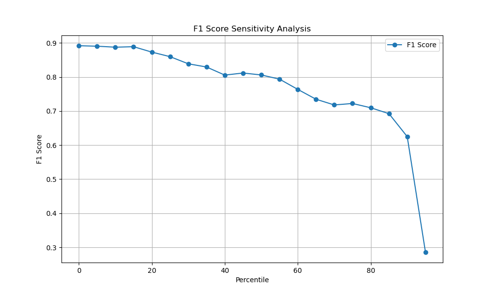

# CollaborLog
Frequent software updates lead to log evolution, posing generalization challenges for current log anomaly detection. Traditional log anomaly detection research focuses on using small deep learning models (SMs), but these models inherently lack generalization due to their closed-world assumption. Large Language Models (LLMs) exhibit strong semantic understanding and generalization capabilities, making them promising for log anomaly detection. However, they suffer from computational inefficiencies.
To balance efficiency and generalization, we propose a collaborative log anomaly detection scheme using an adaptive coordinator to integrate SM and LLM. The coordinator determines if incoming logs have evolved. Non-evolutionary los are routed to the SM, while evolutionary logs are directed to the LLM for detailed inference using the constructed Evol-CoT. To gradually adapt to evolution, we introduce the adaptive evolve mechanism (AEM), which updates the coordinator to redirect evolutionary logs identified by the LLM to the SM. Simultaneously, the SM is fine-tuned to inherit the LLM's judgment on these logs.

# Dataset

./Dataset/Logevol/..
# Run

python ./CollaborLog.py --config './config/spark3.yaml'

# Sensitivity analysis of key parameters

threshold: AE Loss

The higher the loss of the autoencoder, the lower the F1-SCOre, which means that the autoencoder has the ability to select small samples with poor detection results.

